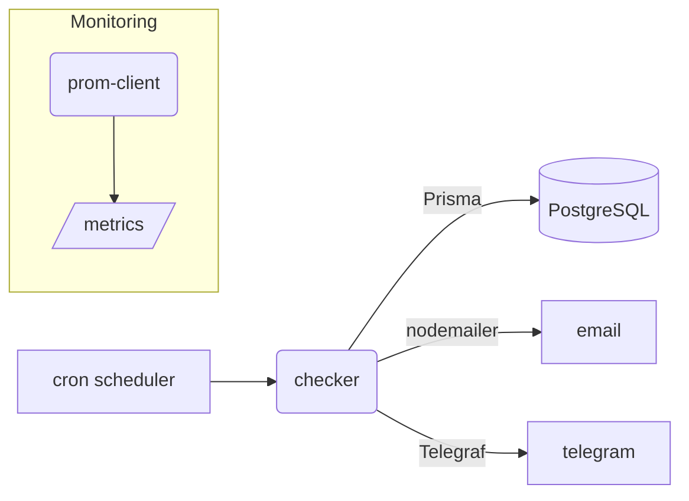

# Zepatrol Worker

_Zincir düğümlerini **sıfır operasyon** ile izleyen, Docker-ready cron servisi._


---

## İçindekiler
1. [Özellikler](#özellikler)
2. [Teknoloji Yığını](#teknoloji-yığını)
3. [Mimari](#mimari)
4. [Dizin Yapısı](#dizin-yapısı)
5. [Kurulum](#kurulum)
6. [Ortam Değişkenleri](#ortam-değişkenleri)
7. [Veritabanı Şeması](#veritabanı-şeması)
8. [Çalışma Mantığı](#çalışma-mantığı)
9. [Test & Kapsama](#test--kapsama)
10. [Prometheus Metrikleri](#prometheus-metrikleri)
11. [Katkı Sağlama](#katkı-sağlama)
12. [Lisans](#lisans)

---

## Özellikler
* ⏲️ **Plan-bazlı sıklık** – Free: 24 saat, Premium: 15 dk.
* 🔍 **Çoklu yöntem** – HTTP, JSON-RPC, ICMP Ping.
* 🚨 **Akıllı uyarılar** – E-posta (tüm planlar) + Telegram (Premium).
* 📈 **Prometheus** – `/metrics` ile gerçek zamanlı istatistikler.
* 🐳 **Docker Compose** – `postgres + worker` tek komutla ayağa kalkar.
* 🧪 **≥ 90 % test coverage** – Jest + Testcontainers.
* 📜 **Tamamen ESM & Node 20** – Derleme adımı yok.

## Teknoloji Yığını
| Katman | Teknolojiler |
|--------|--------------|
| Dil | Node.js 20 (ESM) |
| Görev Zamanlayıcı | node-cron |
| DB Erişim | Prisma ORM + PostgreSQL |
| HTTP İstekleri | axios |
| Bildirimler | nodemailer, telegraf |
| Günlükleme | pino |
| Metrikler | prom-client |
| Test | jest, testcontainers |

## Mimari


## Dizin Yapısı
```text
server/
├─ src/
│  ├─ index.js          # Bootstrap & DI
│  ├─ config/           # Ortam değişkenleri (zod)
│  ├─ modules/          # İş mantığı (checks, alerts, telemetry)
│  ├─ infra/            # Logger, queue placeholder
│  └─ prisma/           # Prisma client singleton
├─ prisma/              # Schema + seed
├─ tests/               # Unit & integration
├─ scripts/             # Yardımcı CLI script'ler (test-alert)
├─ Dockerfile           # Çok katmanlı build
├─ docker-compose.yml   # Postgres + worker
└─ env.example          # Örnek ortam değişkenleri
```

## Kurulum
Detaylı anlatım için [`SETUP.md`](SETUP.md) dosyasına göz atabilirsiniz. Özet:
```bash
# Docker tercih ediyorsanız
$ docker compose up -d --build   # Postgres + worker

# Yerel Node / VPS
$ cd server && cp env.example .env
$ npm ci && npm run migrate && npm run seed
$ npm start
```
> SMTP & Telegram ayarlarını test etmek için: `npm run test-alert`

## Ortam Değişkenleri
Çoğu değişken `env.example` içinde örneklenmiştir:
* `DATABASE_URL` – Supabase veya yerel Postgres.
* `CHECK_INTERVAL_CRON` – Worker tetikleme periyodu.
* `EMAIL_*` – SMTP sağlayıcınız.
* `TELEGRAM_BOT_TOKEN` / `TELEGRAM_CHAT_ID` – (opsiyonel).

## Veritabanı Şeması
Temel tablolar: **User**, **Node**, **Check**.
* `User.plan` alanı free/premium ayrımını tutar.
* `Node.nextCheckAt` => kontrol kuyruğunu belirler.
* `Check` kaydı her health-check sonucunu saklar.

## Çalışma Mantığı
1. node-cron, `env.CHECK_INTERVAL_CRON` ifadesine göre `checker` modülünü tetikler.
2. Checker, `nextCheckAt ≤ now()` olan düğümleri çeker.
3. Node'un `method` alanına bakarak HTTP / JSON-RPC / Ping kontrolü yapar.
4. Sonuç `Check` tablosuna yazılır.
5. Başarısızsa:
   * Her plan → E-posta
   * Premium → Telegram (chatId mevcutsa)
6. `nextCheckAt`, plan bazlı süre kadar ileri alınır (15 dk veya 24 saat).

## Test & Kapsama
```bash
npm test              # jest --coverage  (≥ 90 %)
```
Integrasyon testi Postgres container'ı döndürür, migrasyonları uygular.

## Prometheus Metrikleri
Worker, 9100 portunda `/metrics` endpoint'i sunar:
```
up{service="zepatrol-worker"} 1
health_checks_total 123
health_checks_failed 3
```
Prometheus `scrape_configs` örneği:
```yaml
- job_name: zepatrol-worker
  static_configs:
    - targets: ['worker:9100']
```

## Katkı Sağlama
1. Fork → yeni dal `git checkout -b feature/harika`
2. `npm run lint && npm test` geçtiğinden emin ol.
3. PR aç, detaylı açıklama ekle 🙌

## Lisans
MIT © 2024 